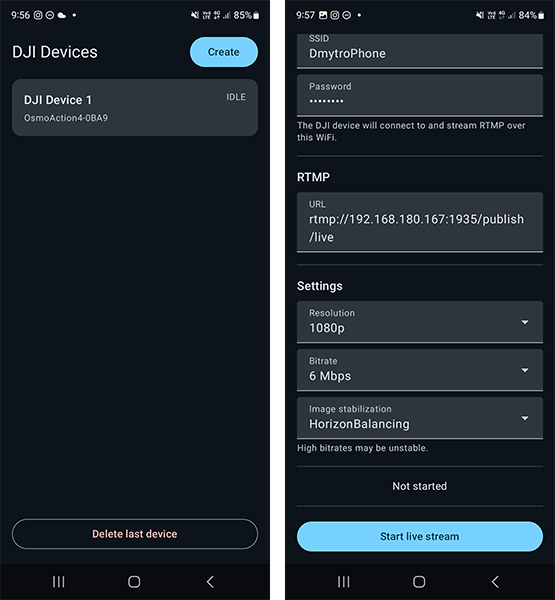

# Unofficial DJI camera remote control Android app for RTMP livestreaming

Android app that can remote control DJI cameras like Action 4 via Bluetooth and allows to configure and start/stop RTMP livestream a lot faster and easier compared to DJI official app Mimo.

This is port from iOS app [Moblin](https://github.com/eerimoq/Moblin).

RTMP stream parameters that can be configured:
- Wi-Fi network name and password
- RTMP URL to stream to
- Resolution
- Bitrate
- Stabilisation

## Feedback

Share ideas or report issues in Discord https://discord.gg/2UzEkU2AJW or create Git issues.

## What cameras are supported?

I only have Action 4 to test. I can confirm it works.

List of all cameras that can work in theory:

- DJI Osmo Action 2
- DJI Osmo Action 3
- DJI Osmo Action 4
- DJI Osmo Action 5 Pro
- DJI Osmo Action 6
- DJI Osmo 360
- DJI Osmo Pocket 3

## How to install

### GitHub releases

I plan to release .apk files using [GitHub releases](https://github.com/dimadesu/dji-remote/releases).

Open [GitHub releases page](https://github.com/dimadesu/dji-remote/releases) on your phone, download .apk file and install.
